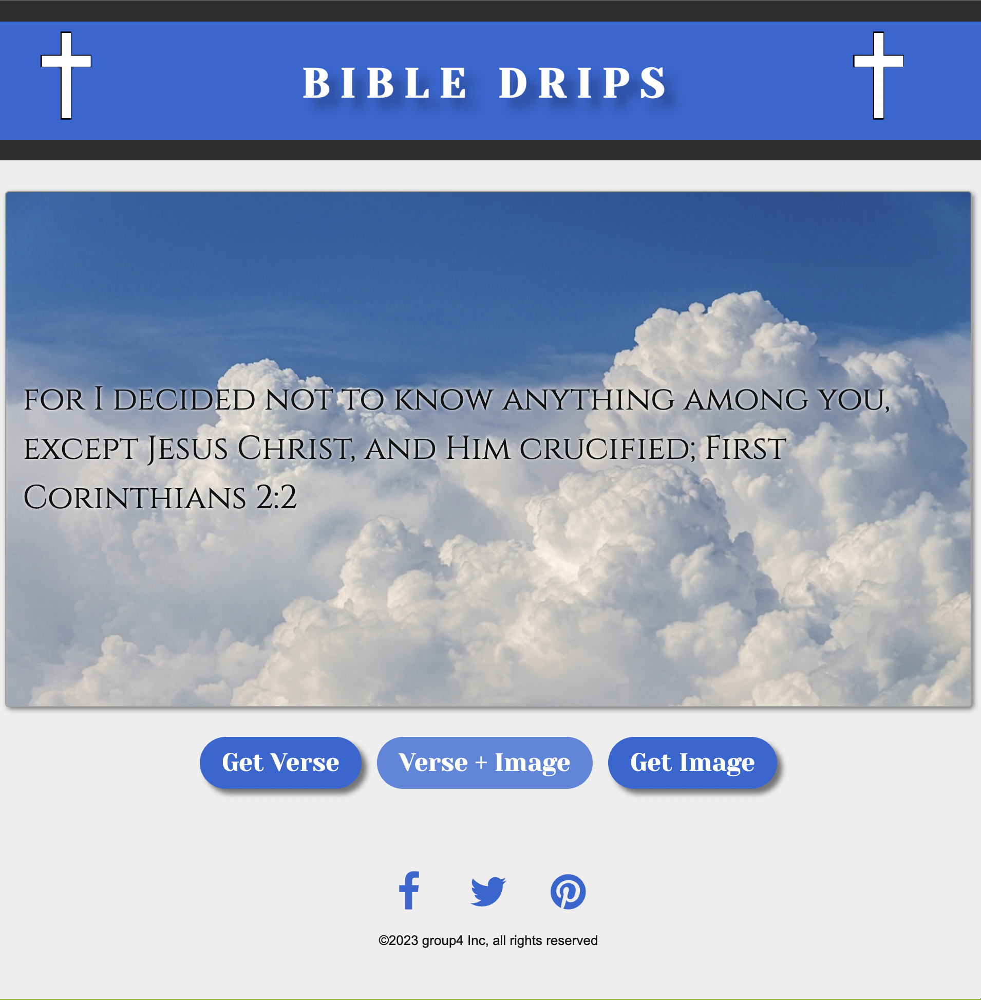
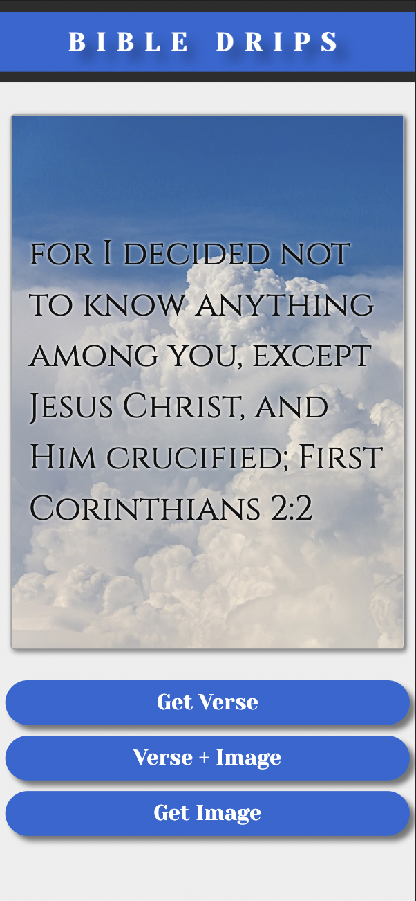

# Bible Drips Web Application

## Description
 Bible Drips is a web application that combines random Bible verses with background images, creating an engaging and inspirational experience for users. The application fetches data from the Scripture API to retrieve Bible verses and utilizes the Pixabay API to fetch background images.

## Table of Contents 

- [Installation](#installation)
- [Usage](#usage)
- [Credits](#credits)
- [License](#license)

## Installation

There is no installation required for this project. Please use the link in the usage section (below) to view the finished product. 

## Usage

Deployed website:
https://sharareh18.github.io/Bible-Drips/

## Credits

Resources:
-  Pixabay API: https://pixabay.com/api/docs/
-  Bible App API: https://scripture.api.bible/
-  Fetch Image Data From API in Javascript:  https://medium.com/geekculture/fetch-image-data-from-api-in-javascript-9a7f5f3048ab
-  Stack Overflow - Where Developers Learn, Share, & Build Careers :  https://stackoverflow.com/
-  How to Create Social Media Share Buttons: https://blog.hootsuite.com/how-to-create-social-media-buttons/

University of California Irvine Full Stack Development Bootcamp 2023 Resources:

-  UCI Web Development office hours: Instructor Logan Garland and TA David Cox

Group 4 Team:
Learned from each other's experiences and knowledge
-Matthew Miller
-Alex Rosu
-Gavin Garcia
-Sharareh Golshani 

## License

None

## Features
Display random Bible verses from different books and chapters.
Show background images related to sky and clouds from Pixabay API.
Store and display the user's last viewed verse using local storage.
Responsive design for various screen sizes.  
Option to share page to social media.  
